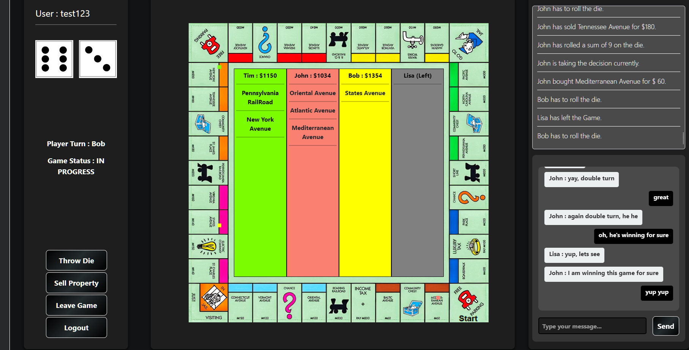
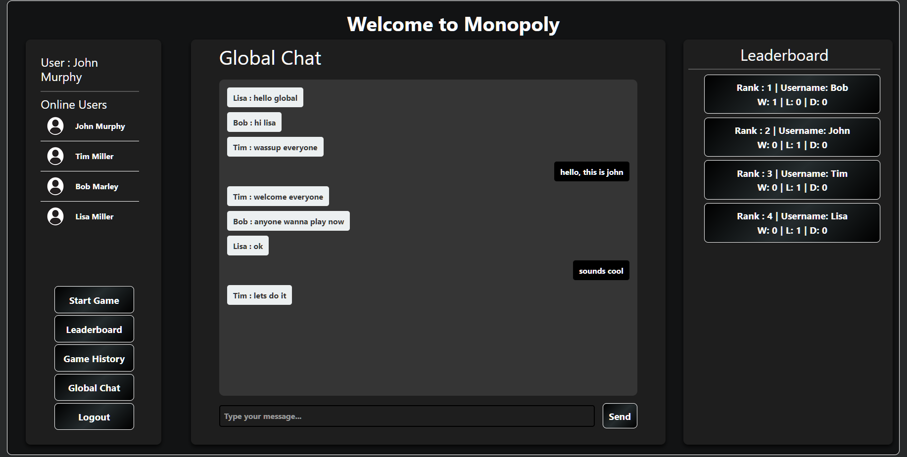

# Multiplayer Monopoly Game

## Overview

This is a multiplayer online Monopoly game developed using Java, Spring Boot, WebSockets, JavaScript, and MongoDB. The game supports up to 4 players, featuring real-time matchmaking, in-game updates, property transactions, and persistent game history. The game also includes global and local chat functionalities, real-time player status tracking, and a leaderboard.

## Features

- **Real-time matchmaking**: Players are added to a matchmaking queue upon clicking "Play Game". A game is initiated once 4 players join the queue.
- **Player assignment**: Players are assigned tokens of different colors (red, green, aqua, yellow) randomly and receive $1500 at the start of the game. A random player is chosen to take the first turn.
- **Game mechanics**: Players roll a die to determine token positions, buy/sell properties, pay rent, and interact with lucky cards (e.g., Free Parking, Community Chest).
- **In-game updates**: A text area provides real-time updates on game events (e.g., property purchases, rent payments).
- **Persistence**: Game and chat histories are saved in MongoDB, allowing players to view their past games.
- **Global chat**: A WebSocket-based global chat area allows all players to communicate.
- **Real-time player tracking**: Online/offline status is tracked and broadcasted to all players.
- **Player statistics**: View detailed player stats (games played, last online, wins, losses) by clicking on a player's name.
- **Leaderboard**: Displays player rankings based on wins.
- **WebSocket communication**: Game interactions, including state updates, are handled using WebSockets to broadcast the new game state to all players in real-time.
- **Player authentication**: Implemented using SHA-256 and salting. The login page serves both as signup and login. Passwords are verified during login, and new users are added to the database if the username is not present.

## Technology Stack

- **Backend**: Java, Spring Boot, WebSockets, MongoDB
- **Frontend**: JavaScript, JSP
- **Deployment**: Docker

## Installation

### Prerequisites

- Java 21 or later
- Docker
- MongoDB

### Steps

1. **Clone the repository**:
    ```sh
    git clone https://github.com/yourusername/multiplayer-monopoly.git
    cd multiplayer-monopoly
    ```

2. **Run the application using an IDE**:
    - Open the project in VSCode or IntelliJ.
    - Run the application using the embedded Tomcat server.

3. **Run the application using Docker**:
    - **Pull the Docker image**:
      ```sh
      docker pull shahid1177/monopoly:latest
      ```
    - **Run the Docker container**:
      ```sh
      docker run -d -p 8080:8080 --name monopoly shahid1177/monopoly:latest

## Usage

### Starting a Game

- Players click "Play Game" to join the matchmaking queue.
- When 4 players are in the queue, a game and a game chat room are created.
- Players are assigned tokens and a random player is given the first turn.

### Playing the Game

- Players roll the die to determine their token positions.
- Players decide whether to buy properties or pay rent.
- If a player can't pay rent, they are stuck until they can.
- The game continues until one player remains solvent.

### Game Events

- **Property transactions**: Players can buy/sell properties and pay/collect rent.
- **Lucky cards**: Players may encounter Free Parking, Community Chest, Income Tax, Jail, etc.
- **In-game updates**: Events are displayed in a text area within the game interface.

### Chat

- **Global chat**: All players can communicate through a WebSocket-based global chat area.
- **Game chat**: Players in a game have a dedicated chat room.

### Persistence and History

- Game and chat histories are saved in MongoDB.
- Players can view their game history and stats.

### Player Tracking

- Real-time online/offline status is tracked and broadcasted.
- Detailed player stats are available by clicking on a player's name.

### Leaderboard

- Displays player rankings based on the number of wins.

## Authentication

- **Player authentication**: Implemented using SHA-256 and salting.
  - During login, players provide their username, password, and full name.
  - If the username is found in MongoDB, the password is verified.
  - If the password matches, the player is authenticated.
  - If the password does not match, authentication fails.
  - If the username is not found, the player is added to the database.
  - The login page serves both as signup and login.

## Screenshots of gameplay



